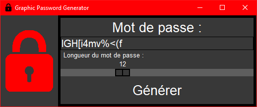

# Graphic Password Generator

Graphic Password Generator est comme son nom l'indique un générateur de mot de passe avec une interface graphique. Il génère des mots de passe de façon sécurisée grâce au module `secrets.py`. L'utilisateur choisit la longueur du mot de passe entre 4 et 30 caractères. Le mot de passe généré comporte lettres, chiffres et caractères spéciaux.



# Installation sur Linux

**NOTE**: Python 3.6 ou ultérieur est requis.

```bash
git clone https://github.com/JusticeReaper/GraphicPassGen
```

# Installation sur Windows

- **1.** Telechargez [Graphic Password Generator](https://github.com/JusticeReaper/GraphicPassGen/archive/master.zip)

- **2.** Installez Python depuis le Store Windows

- **3.** Décompressez `GraphicPassGen-master.zip`

# Exécution

Allez dans le répertoire `GraphicPassGen-master` et exécutez la commande :
```bash
python3 GraphicPassGen.py
```